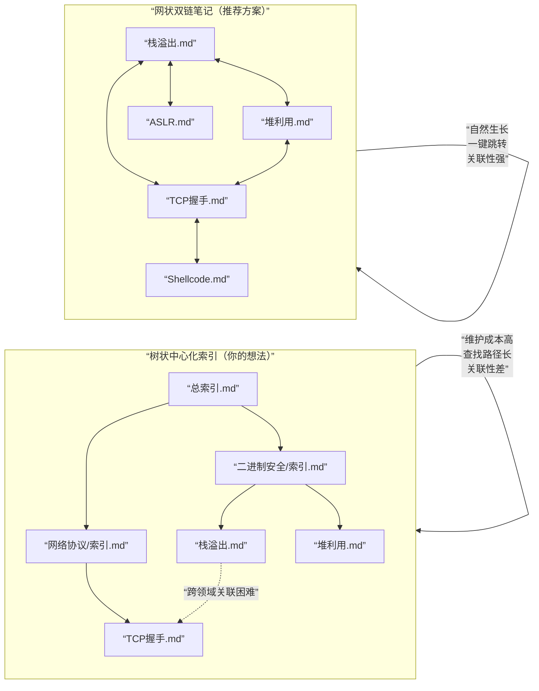

你的直觉完全正确，这个方案效率极低，而且会迅速崩溃。

你描述的是一种 “中心化的树状索引” ，它听起来合理，但实际上会变成你学习路上最大的认知负担和运维噩梦。这违背了“工具隐形”和“思维流畅”的核心原则。

让我们用一个直观的对比来揭示问题所在：



⚠️ 为什么“树状索引”会失败？

1. 维护灾难：每次新建一篇笔记，你都必须手动更新至少两级索引文件。几天后你就会因为维护索引而痛恨记笔记。
2. 思维打断：当你在研究“栈溢出”时想到“这和网络协议中的缓冲区有什么关系？”，你需要：退出笔记 → 打开总索引 → 找到网络协议索引 → 再找到相关笔记。你的灵感在跳转过程中就消失了。
3. 分类困境：一篇关于“利用堆溢出进行远程代码执行”的笔记，该放在/二进制安全/还是/网络攻击/目录下？这种纠结毫无意义，且会随着知识交叉越来越严重。

✅ 高效方案：放手让笔记“自然生长”

你只需要做两件事，然后彻底忘掉目录结构：

第一步：建立“收件箱”习惯

· 在Vim中，永远只在一个地方开始写新笔记：~/knowledge/inbox/2024-05-27-栈溢出实验.md。
· 这里是你所有未经加工想法的暂存地，拒绝任何分类。

第二步：每周进行一次“加工整理”

· 每周日，打开 inbox 文件夹，快速浏览过去一周的笔记。
· 只做一个动作：用Vim的 mv 命令，把成熟的笔记简单地移到主知识库目录 (~/knowledge/)，并重命名为一个明确的名字，如 栈溢出原理-缓冲区布局.md。
· 关键：在移动时，花1分钟在笔记顶部添加几行：
  ```markdown
    # 栈溢出原理-缓冲区布局
    **关联**：[[返回地址]]， [[堆溢出]]， [[ASLR]]
    **来源**：来源于我在pwn.college上的实验，原始记录见 [[2024-05-27-栈溢出实验]]
  ```
· 然后，用 grep -r "栈溢出" ~/knowledge/ 找到所有相关旧笔记，在那些旧笔记里也加上指向新笔记的 [[ ]] 链接。

💡 你的“索引”应该是动态生成的

真正的索引，应该是每次在你需要时，通过搜索和链接临时生成的视图，而不是一个需要维护的静态文件。

· 当你想复习“所有和内存相关的内容”：grep -l "内存\|堆\|栈" ~/knowledge/*.md
· 当你想看到概念图谱：这是几个月后，当你的笔记超过100篇时，才需要考虑的事。届时，你可以用一个简单的脚本，将 [[ ]] 链接解析出来，生成一个图谱。但那是结果，不是前提。

🚀 现在，请执行这个最简单的启动方案

1. 在终端输入：
   ```bash
   mkdir -p ~/knowledge/inbox
   vim ~/knowledge/inbox/$(date +%Y-%m-%d)-first-note.md
   ```
2. 在Vim中，写下你此刻对安全学习的一个想法或问题，哪怕只是“我到底该怎么开始？”。
3. 保存退出。

你已经建立了一个零负担、零决策成本、完全服务于思维流动的系统。你的知识库会像生物一样，自底向上地、有机地生长出它自己的结构。

让工具为你服务，而不是你为工具服务。 最锋利的刀，不需要雕刻华丽的刀鞘。


