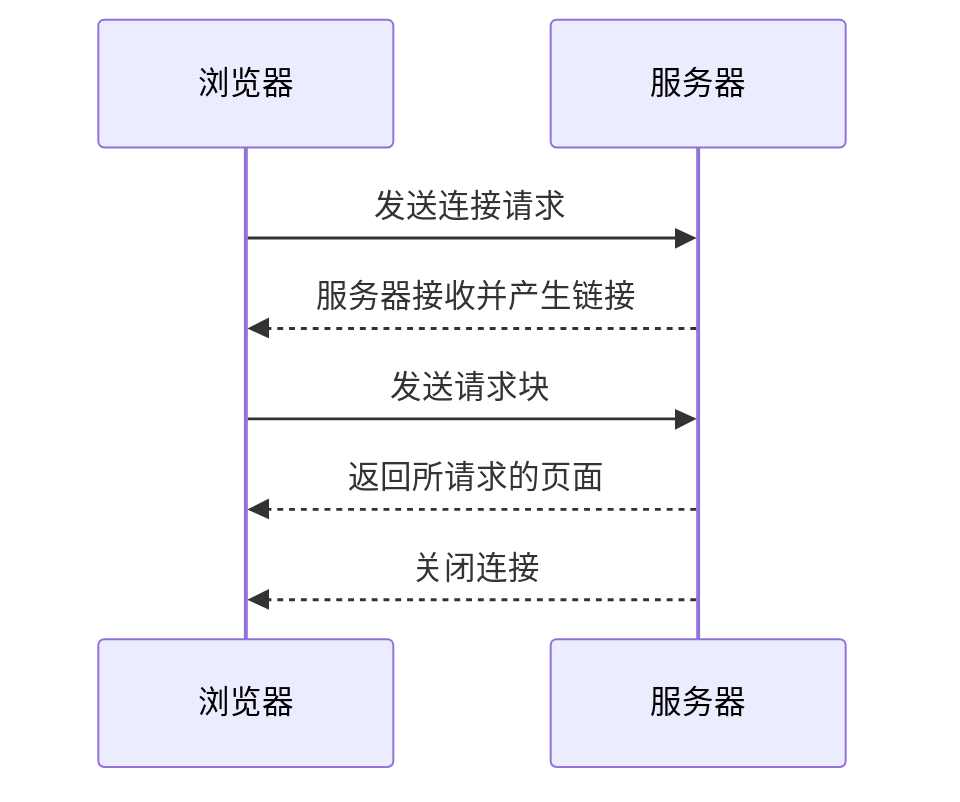

---
[[http]] [[sql_injection]] [[html]]
---
tcp层级大致结构：应用层，传输层，网络层，物理层
# web基本概念
## HTTP
**定义**: 基于请求与响应模式的应用层的协议,
基本模型：

http
*q:http请求发送后服务器如何接受请求，如何处理请求，如何响应请求。*
1.http请求和响应都是通过socket编程接口连接操作系统，通过操作系统底层进行tcp/ip协议栈通信
socket编程接口接受请求

## HTML
### <form>：表单，可用于发送请求，提交用户输入数据
- action:决定提交的表单数据到哪个URL(默认当前页面URL)
- method:决定请求类型(如GET)
[注]:form的<select> <input>这些标签都用于提交数据，通过特定语法指定名称和值
