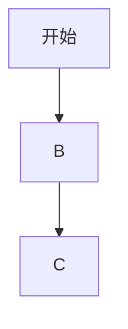

---
[[mermaid]]
- 常用语法
# 流程图(graph)


## 方向控制
graph TD:top to bottom
graph LR:left to right
graph RL:right to left
graph BT:bottom to top
## 节点形状
[文本]: 矩形
((文本)): 圆型

## 连接线形状
--> 实线
-.-> 虚线
-- 文字 --> 带文字

# 时序图(sequenceDiagram)
```mermaid
sequenceDiagram
    participant A as 名字
    participant B as 名字
    participant C as 名字
    participant D as 名字
                        %% 这是注释符号
                        %% ->> 实线
                        %% -->> 虚线箭头
            %%Note over 名字1,名字2:文本 %%这个命令会出现一个文本框,覆盖两个参数的时间线

    
